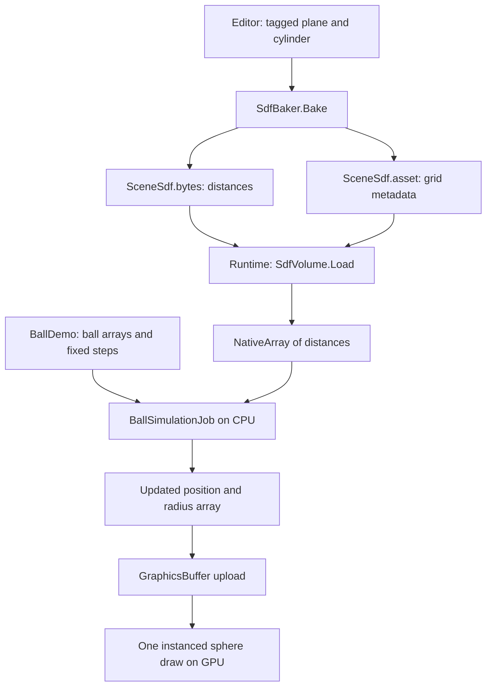

# Understanding this SDF physics project

A guided tutorial for the implementation in this repository. Start here if you can read basic C# and have used Unity GameObjects, but Jobs, Burst, signed distance fields, or instanced rendering are new to you.

Allow about two hours for the first pass, including the experiments. You do not need to understand every shader instruction before running the scene.

## 1. What you built

There is one simulation controller and several arrays containing 10,000 balls. A ball is data: its position, radius, velocity, and time spent nearly stationary. It is not a GameObject.

The ground and cylinder have two representations:

- Visible meshes, which the camera renders.
- A baked grid of distances, which the simulation samples for collision.

Those representations are connected by the editor baker, not by Unity's physics engine. Moving the visible cylinder without rebaking does not move its collision surface.



The CPU computes motion. The GPU draws the result. GPU instancing does not mean GPU simulation.

## 2. First run: connect the scene to the code

Open `Assets/Scenes/SdfPhysics.unity` and press Play. The demo starts with 10,000 balls. Select **SDF Ball Simulation** in the Hierarchy. Its `BallDemo` component references the baked volume, sphere mesh, and ball material.

Press **R** to reset the rain. Wait for the balls to settle and watch the sleeping count increase. Press **Space** to pause. Balls overlapping one another is intentional: this project only resolves ball-versus-static-geometry contacts.

Stop Play mode and set the component's **Ball Count** to 100 for an easier view. Enter Play again. Set it back to 10,000 when finished. The runtime **x2** and **/2** buttons double or halve the current count, with halving rounded down to a minimum of 1. **Max Ball Count** sets an optional upper limit; 0 is the default and means no user-defined cap. Memory and graphics-buffer limits still apply. Both buttons call `SetCount`; editing the count field directly during Play does not perform the required array resizing.

Read the files in this order:

| File under `Assets/` | What to learn from it |
| --- | --- |
| `Runtime/BallDemo.cs` | Startup, ownership, scheduling, upload, draw, cleanup |
| `Runtime/SdfVolume.cs` | Loading the field and sampling it |
| `Runtime/BallSimulationJob.cs` | Gravity, movement, collision, friction, sleep |
| `Shaders/InstancedBalls.shader` | How array entries become visible spheres |
| `Editor/SdfBaker.cs` | How collision data is generated before runtime |
| `Editor/DemoBuilder.cs` | Scene, material, and low-poly sphere creation |
| `Editor/SimulationValidation.cs` | What the automated checks actually establish |
| `Runtime/BurstExecutionProbe.cs` | How native Burst execution is detected |

`SdfGeometry` is an authoring tag identifying a plane or cylinder through its `Shape` property and `geometryShape` enum (`PLANE` or `CYLINDER`). The `.asmdef` files separate runtime code from editor code and declare package dependencies. Editor-only asset creation and build APIs do not belong in the player.

Names tell you how a member is used: `_ballCount` is a private serialized field, `mPositions` is private runtime state, and `BallCount` is the public property. Private static fields use `_sCamelCase`; public static fields use `sCamelCase`. Public methods such as `ResetBalls` use PascalCase, while private helpers such as `disposeBalls` use camelCase. Unity callbacks keep their required spelling, including `OnEnable`, `Update`, and `OnDisable`.

## 3. A signed distance field in numbers

A signed distance field answers: “At this point, how far am I from the surface, and am I inside or outside?”

| Value | Meaning |
| --- | --- |
| `+0.3` | Outside, 0.3 metres from the surface |
| `0` | On the surface |
| `-0.3` | Inside, 0.3 metres from the surface |

For an infinite horizontal ground surface at `y = 0`, the signed distance is simply `d(p) = p.y`. Our finite ground behaves like that near its top, away from its edges.

A sphere needs space for its radius. If its centre is 0.1 m above the ground and its radius is 0.065 m, the sphere's bottom is 0.035 m above the ground.

The simulation calculates:

```csharp
float gap = distance - ball.w - Skin;
```

Here `ball.w` is the radius and `Skin` is 0.002 m. At that position:

```text
centre distance = 0.100 m
radius          = 0.065 m
skin            = 0.002 m
remaining gap   = 0.033 m
```

At rest on the flat ground, the centre is approximately `0.065 + 0.002 = 0.067 m` high. It should not be at `y = 0`: that would put half the sphere inside the ground.

The field also supplies a gradient: the direction in which distance increases most rapidly. Normalizing it gives the outward surface normal. Above the ground this is `(0, 1, 0)`; beside the cylinder it points sideways.

**Checkpoint:** Why is testing `distance < 0` insufficient for a ball? Because its centre can be outside while its surface already intersects the geometry. We must account for radius.

## 4. Baking: turn geometry into a persistent asset

Read `SdfBaker.Distance` and `SdfBaker.Bake`.

The baker does not inspect every triangle in an arbitrary mesh. It recognizes the two supported primitive types and evaluates mathematical distance formulas using their transforms.

It first subtracts the object's position and undoes its rotation. Dimensions are then calculated from the object's scale. These coordinates remain in metres; the implementation does not divide the point by a nonuniform scale and pretend its distance is unchanged.

### The ground

A plane has no thickness and therefore no enclosed interior. The baker represents it as a box extending from the ground surface one metre downwards. For the default plane its half-widths are 5 m in X and Z.

For a box, `q` measures how far a point is beyond each face:

```text
q = abs(point relative to box centre) - box half extents
```

The length of the positive components gives the outside distance. If all components are negative, the largest component gives the negative distance to the closest face. The expression in `Distance` combines these two cases.

### The cylinder

The cylinder formula reduces the problem to two distances:

```csharp
float radial = new Vector2(local.x, local.z).magnitude - 0.5f * scale.x;
float vertical = Mathf.Abs(local.y) - scale.y;
```

The default cylinder has radius 0.5 m and half-height 1 m. Its centre is at `(0, 1, 0)`, so its bottom rests at 0 and its top is at 2.

Outside both the side and cap, the distance is the length of the positive radial/vertical pair. Inside both, the larger negative value describes the nearest surface.

For multiple sources, the baker stores the minimum distance. This represents their union: a point inside either solid is inside the combined field. It preserves the union's sign and boundary, but is not generally the exact interior Euclidean distance where solids overlap.

### The grid

The bake uses:

```text
origin:       (-5.5, -1, -5.5)
maximum:      ( 5.5,  7,  5.5)
spacing:      0.0625 m
sample count: 177 x 129 x 177
```

These are sample points at grid vertices. There are 176 intervals across 177 samples. Thus `176 * 0.0625 = 11 m` across X.

Every distance is a 4-byte float. Total storage is `177 * 129 * 177 * 4 = 16,165,764 bytes`, about 15.42 MiB.

`Assets/Baked/SceneSdf.bytes` contains the float values; `SceneSdf.asset` contains the origin, dimensions, spacing, and reference to that data. `SdfVolume` stores these in private serialized fields and exposes read-only properties; the baker assigns them through `Initialize`. Preserve their `.meta` files so Unity retains asset references.

**Experiment:** Outside Play mode, move the cylinder 1 m along X, save the scene, and enter Play without baking. Contacts remain at the old location. Stop, choose **SDF Physics > Bake open scene**, and try again. Restore the cylinder to `(0, 1, 0)`, save, and rebake afterward. The validation tests assume the default geometry.

## 5. Sampling: turn eight numbers into distance and normal

Read `SdfVolume.Load` and `SdfGrid.Sample`.

`Load` interprets the stored bytes as floats and copies them into a persistent `NativeArray<float>`. This is loading precomputed results, not baking on startup. The job accesses this native array rather than a managed Unity asset.

A native array is a handle to unmanaged memory. Copying the `SdfGrid` struct into a job copies that handle and metadata; it does not duplicate the whole 15.42 MiB field.

`Sample` converts a world position to grid coordinates:

```csharp
float3 gridPosition = (position - Origin) / CellSize;
int3 cell = math.clamp((int3)math.floor(gridPosition), 0, Size - 2);
float3 fraction = gridPosition - cell;
```

`cell` identifies the lower corner of the containing cell. `fraction` gives the fractional position inside it. For `gridPosition.x = 12.25`, the point lies one quarter of the way from sample 12 to sample 13.

Clamping the cell index to `Size - 2` leaves room for the upper corner. At the maximum face, the last cell is selected with interpolation weight 1. That prevents an out-of-range array access.

The 3D grid is flattened into one array:

```csharp
int index = cell.x + Size.x * (cell.y + Size.y * cell.z);
```

Moving one sample in X adds 1. Moving one in Y adds `Size.x`. Moving one in Z adds `Size.x * Size.y`. These strides match the baker's X-inside-Y-inside-Z loop order.

The eight corner values have names such as `value000` and `value100`; the three digits give each corner's X, Y, and Z offsets from the cell origin. The code blends along X, then Y, then Z. This is **trilinear interpolation**. Linear interpolation is just:

```text
lerp(a, b, t) = a + t * (b - a)
```

For example, blending `0.2` and `0.4` at `t = 0.25` gives `0.25`.

The gradient differentiates those same blends. Along X, `value100 - value000` is one edge's distance change; blending the parallel edge differences gives the local X derivative. Dividing by cell size converts “change per cell” into “change per metre.” The Y and Z components follow the same idea.

This is one eight-value sampling stencil that returns both distance and gradient. It is not literally one float read, and collision can call it multiple times during a substep.

Outside the grid, `Sample` returns positive infinity and a zero gradient. The simulation detects escaped balls and respawns them instead of treating the last voxel as an infinitely extended wall.

## 6. Arrays, Jobs, and Burst

Read `BallDemo.SetCount` and the fields of `BallSimulationJob`.

| Array | Entry for ball i | Bytes per ball |
| --- | --- | ---: |
| `Positions` | `float4(x, y, z, radius)` | 16 |
| `Velocities` | `float3(vx, vy, vz)` | 12 |
| `RestTimes` | seconds spent nearly resting | 4 |

The CPU simulation has 32 bytes of ball state per ball, or about 320 KB for 10,000 balls, excluding allocator overhead. The GPU only needs the 16-byte position/radius entry.

`IJobParallelFor` asks Unity to run `Execute(index)` for every ball. Each execution changes only its own array entries and reads shared immutable field data. This independence is what permits parallel execution without balls racing to modify one another.

```csharp
mHandle = new BallSimulationJob { /* arrays and settings */ }
    .Schedule(_ballCount, 128);
mHandle.Complete();
```

128 is the inner-loop batch size parameter, not the number of threads. Unity distributes the work across available workers. `Complete` makes the updated arrays safe for subsequent upload and reuse. Immediately completing still allows parallel execution inside the job, but provides little opportunity to overlap it with unrelated main-thread work.

Jobs supply scheduling and concurrency. Burst compiles compatible C# to optimized native CPU instructions. `float3`, `float4`, and `math` come from Unity Mathematics and are suitable for this style of code. There is no GPU compute shader here.

`Allocator.Persistent` means the memory survives across frames and must be disposed explicitly. `OnDisable` completes any job before freeing buffers and arrays. Disposing memory while workers use it would be invalid.

## 7. Rendering frames and simulation ticks are different

Read `BallDemo.simulate`, which `Update` calls once per rendered frame.

The simulation tick is `1 / 120 s`, about 8.33 ms. A 60 fps rendering frame lasts about 16.67 ms, so it normally needs two simulation ticks. At 240 fps, some frames need no simulation tick at all.

```text
accumulator += elapsed game time
steps = whole fixed intervals that fit
accumulator -= steps * fixed interval
```

The implementation caps accumulated time at eight ticks, about 66.67 ms. A long stall therefore drops time instead of causing an unbounded catch-up workload or a single enormous physics step. This sacrifices real-time accuracy during large stalls.

All required ticks are processed inside each ball's `Execute`. Because balls do not interact, one ball completing its ticks before another is harmless. That arrangement would need reconsideration if ball-to-ball contacts were added.

## 8. Follow one ball through collision

Read `BallSimulationJob.Execute` from top to bottom.

### Start and gravity

The job copies one ball's data into local variables. A sleeping ball returns immediately. An escaped ball is respawned. Each tick then changes velocity:

```csharp
velocity.y -= 9.81f * DeltaTime;
```

At 120 Hz, gravity changes vertical velocity by approximately `-0.08175 m/s` per tick. Movement subsequently uses that updated velocity: a semi-implicit integration step.

### Approach the surface without jumping through it

An endpoint-only test would move the ball first and ask whether its final position penetrates. A sufficiently fast ball could cross a whole object and finish outside on the other side.

This implementation repeatedly samples clearance and advances by a limited distance:

```csharp
float stepTime = math.min(remainingTime, gap * 0.55f / math.max(speed, 0.00001f));
position += velocity * stepTime;
remainingTime -= stepTime;
```

If clearance is 0.2 m and speed is 10 m/s, the clearance-based time limit is `0.2 * 0.55 / 10 = 0.011 s`. The ball never uses more than the tick's remaining time.

Why 0.55? Adjacent samples of these distance functions differ by at most their spatial separation. Each derivative component of their trilinear interpolant is therefore bounded by 1, so its gradient magnitude can reach `sqrt(3)`. Multiplying clearance by less than `1 / sqrt(3)`, approximately 0.577, gives a conservative travel distance relative to the interpolated field.

This guarantee concerns movement through the interpolated field while using that branch. The field approximates the visible geometry. The special near-contact movement below is a practical bounded step, not the same clearance proof.

The loop allows at most 48 iterations. When it runs out, it discards unused movement time. At extreme speeds or difficult contacts, that can slow a ball; it does not deliberately take a final unchecked large step.

### Correct position, then velocity

Near contact, the gradient becomes a unit normal. Position is moved outward if necessary. This addresses overlap; it does not by itself remove the inward velocity that would recreate the overlap next tick.

Velocity is separated into normal and tangential parts:

```csharp
float normalSpeed = math.dot(velocity, normal);
float3 tangent = velocity - normalSpeed * normal;
```

For a floor normal `(0, 1, 0)` and velocity `(2, -3, 0)`:

```text
normalSpeed     = -3
normal velocity = (0, -3, 0)
tangent velocity = (2, 0, 0)
```

A negative `normalSpeed` means the ball is approaching the surface. The response reverses and reduces that component. A fast impact uses restitution 0.32, so the upward speed in this example becomes `0.96 m/s`. Impacts slower than 0.6 m/s use zero restitution to avoid perpetual tiny bounces.

Friction reduces tangential speed by an amount based on the normal impulse. In this example, the permitted reduction is `0.65 * 1.32 * 3 = 2.574 m/s`, enough to remove all 2 m/s of tangential motion. The clamp prevents friction from reversing the tangent direction.

After response, the solver permits movement of at most `CellSize / 16`, about 3.91 mm, so touching balls can slide rather than getting stuck taking zero-length clearance steps. It rechecks contact and performs up to eight final projection corrections. This is tuned for the scene's thick solids; it is not a general guarantee for arbitrarily thin geometry or deeply embedded starting points.

### Sleep

The support condition is `normal.y > 0.65`, so a vertical cylinder wall cannot count as ground support. Speed must be below 0.05 m/s: the code compares squared speed with `0.0025` to avoid a square root.

After 0.4 s of qualifying contact, velocity is zeroed and future executions return early. This removes residual numerical jitter and saves collision work. There is no automatic wake-up when geometry moves: the baked geometry is assumed static. Resetting the balls clears sleep state.

**Checkpoint:** Positional projection, restitution, friction, and sleep solve four different issues: overlap, inward normal motion, sliding, and persistent tiny motion.

## 9. How one draw produces 10,000 spheres

Read the upload/draw lines in `BallDemo.Update` and `InstancedBalls.shader`.

```csharp
mBuffer.SetData(mPositions);
Graphics.RenderMeshPrimitives(mRenderParams, _ballMesh, 0, _ballCount);
```

The GPU receives one buffer of `(x, y, z, radius)` entries and one mesh to repeat. `SV_InstanceID` identifies which ball each mesh instance represents:

```hlsl
float4 ball = _Balls[input.id];
float3 worldPosition = ball.xyz + input.positionOS * ball.w;
```

The generated sphere has radius 1. Multiplying a vertex by `ball.w` gives the desired radius; adding `ball.xyz` places it in the world. `TransformWorldToHClip` applies the camera transformation.

No per-ball matrix is needed because this implementation uses translation and uniform scale only. Its normals retain their direction under positive uniform scale and no rotation. That shortcut would need changing for arbitrarily transformed meshes.

The instance ID also generates a repeatable colour blend. The fragment shader uses the dot product between the surface normal and the main light direction for simple diffuse lighting, plus a small constant base term.

The mesh has 62 vertices and 120 triangles. At 10k instances that is 1.2 million submitted triangles. Instancing reduces CPU submission overhead; the GPU still transforms and rasterizes the repeated geometry.

The phrase “one draw” applies to the balls' forward pass. The ground, cylinder, and UI add their own work. Ball shadow passes are disabled. There is one combined world bound and no individual ball culling. Sleeping balls are still uploaded and drawn.

## 10. Understand the tests and measurements

`SimulationValidation` is a custom editor validation command, not an NUnit fixture. Choose **SDF Physics > Validate baked field and simulation** with the default baked scene data.

It checks field signs, a flat-ground gradient, boundaries, high-speed impacts, recovery from a small initial penetration, and settling of 10,000 balls. The rain test runs `300 * 8 / 120 = 20` simulated seconds and requires at least 99% to sleep. It also checks exact position stability for sleeping balls.

The reported 35,792 assertions include repeated checks over balls and steps, plus scene-reference and default-setting checks added during the naming refactor. They are not 35,792 independently designed scenarios. Penetration checks mostly query the same sampled field used by the solver. They do not exhaustively establish agreement with the visible mesh at every corner, arbitrary initial condition, or transform.

The extreme-impact tests check the immediate collision, then reset to a normal zero-velocity drop for the settling check. An extreme bounce may leave the finite volume and trigger a legitimate respawn, so demanding the original landing location after that would test the wrong behaviour.

`BurstExecutionProbe` starts with `native = 1`. A method marked `[BurstDiscard]` changes it to zero in managed execution. Burst removes that method call, leaving one. This distinguishes native execution of the probe from merely having Burst installed.

During the original run, Windows blocked the editor's generated Burst JIT DLL, so editor correctness checks used the managed fallback. The standalone AOT build reported native execution. This is recorded in `Validation/environment.txt`; it is historical evidence, not a fresh check of today's machine settings.

The benchmark repeatedly resets the rain to include moving balls. It separately measures settled balls. Its offscreen path explicitly renders and waits for GPU readback because hidden windows otherwise skipped rendering.

The recorded 10k median was 0.86 ms at 1280 x 720 on the Ryzen 5 5600G / RTX 5060 Ti. It includes offscreen synchronization overhead and excludes the IMGUI overlay and presentation. Do not describe it as a measured normal-window FPS result or isolated GPU time. The job/wait average includes frames with no simulation tick. See the README for the full table and reproduction command.

## 11. Guided experiments

Make one change at a time and restore the baseline before running the default validation. Keep a copy or a version-control checkpoint before editing code or baked assets.

| Experiment | Change | What to observe or predict |
| --- | --- | --- |
| More visible balls | Set **Ball Count** (`_ballCount`) to 100 before Play | Individual bounces and cylinder contacts become easier to follow |
| Larger balls | Set radius to 0.12, then reset if already playing | Flat-ground centre height should become approximately 0.122 m |
| No bounce | Temporarily make `bounce` zero in `Execute` | Balls still collide, but impacts no longer rebound |
| Less friction | Temporarily change 0.65 in the tangent formula to 0.1 | Balls with tangential velocity slide longer; a straight vertical drop is a poor friction experiment |
| Longer activity | Temporarily raise `SleepDelay` from 0.4 to 5 | Sleeping count rises later; fixed low-speed response may already look stationary |
| More instances | Press **x2** to double the count; use **/2** to reduce it | Submission remains one ball draw, but upload and geometry work grow |
| Move the cylinder | Move, test without baking, then bake | Demonstrates the separation between visible geometry and collision data |

For a deliberate sliding experiment, temporarily assign an X velocity such as `new float3(2, 0, 0)` in `ResetBalls` instead of zero. Reset to apply it. Balls can slide off the finite ground and recycle.

For a coarser grid with the same bounds, change spacing to `0.125` and dimensions to `(89, 65, 89)` in `SdfBaker`, then rebake. Notice why spacing and dimensions must change together: `(count - 1) * spacing` determines the bounds. Predict reduced memory and less accurate curved contacts. Restore `0.0625` and `(177, 129, 177)` and rebake afterward. Changing spacing alone changes the represented world region and makes the hardcoded bake-bound validation inconsistent.

Do not use **Create demo scene** as a routine rebake command. It rebuilds scene content and generated assets. `BuildSubmission` also recreates the default scene before validation and building; it is intended for reproducing the baseline, not preserving experimental scene edits.

## 12. Explain it yourself

Try answering these without opening the source, then check the notes.

1. **What is stored for a ball?** Position/radius, velocity, and rest time; no individual GameObject.
2. **What is stored in the field?** One signed float distance at each grid vertex, plus metadata describing the grid.
3. **Why subtract radius?** The centre's distance alone does not detect the sphere's surface crossing geometry.
4. **Where does the normal come from?** The normalized analytic derivative of the trilinear interpolant.
5. **How are fast impacts handled?** Repeated clearance-limited advancement, bounded near-contact motion, and projection, with a finite iteration budget.
6. **Why can this run in parallel?** A ball writes only its own state and reads shared immutable field data.
7. **What does Burst contribute?** Native CPU compilation; Jobs provide scheduling.
8. **What makes rendering cheap to submit?** A shared sphere mesh and one instanced call using a compact position/radius buffer.
9. **What still scales with count?** CPU updates, memory traffic, GPU upload, vertices, triangles, and pixel work.
10. **What would break the assumptions?** Moving geometry without rebuilding the field, arbitrarily thin geometry, or adding ball-to-ball interaction without redesigning the solver.

A useful explanation to rehearse: “I bake analytical primitive distances into a finite grid. At runtime, a Burst parallel job samples that grid to advance and resolve independent spheres at a fixed timestep. I upload only position and radius, then use the GPU instance ID to draw a shared sphere mesh for every entry.”

As a next exercise, extract the contact-response calculation into a small helper and add a test that supplies a known normal and incoming velocity. Predict the reflected and friction-reduced velocity numerically before running it. That is a manageable way to demonstrate that you understand the collision response rather than only the scene's appearance.
